# Анализ данных соискателей

В данном проекте представлен анализ данных соискателей. Ниже приведены визуализации с кратким описанием.

## Визуализации

### 1. Количество соискателей, требующих заработную плату выше 1 миллиона рублей
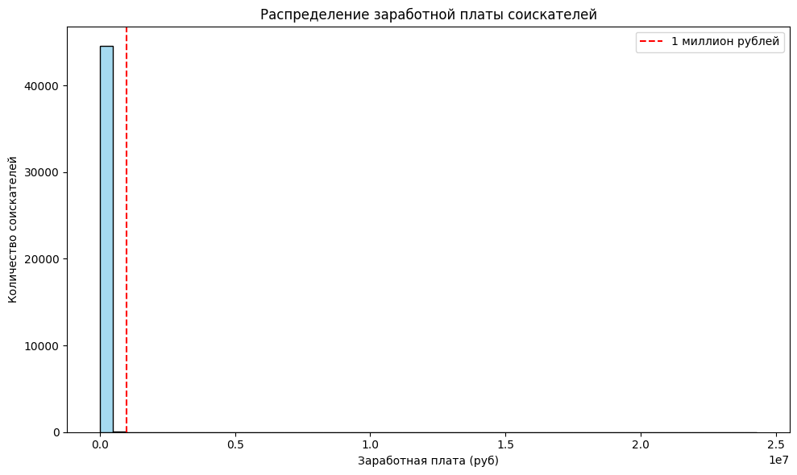

---

### 2. Распределение признака "Возраст"
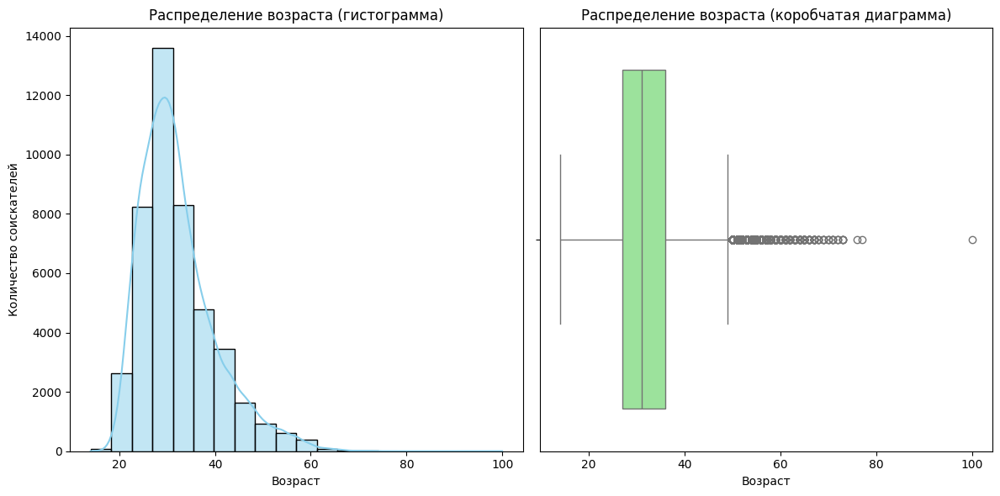

---

### 3. Распределение признака "Опыт работы (месяц)"
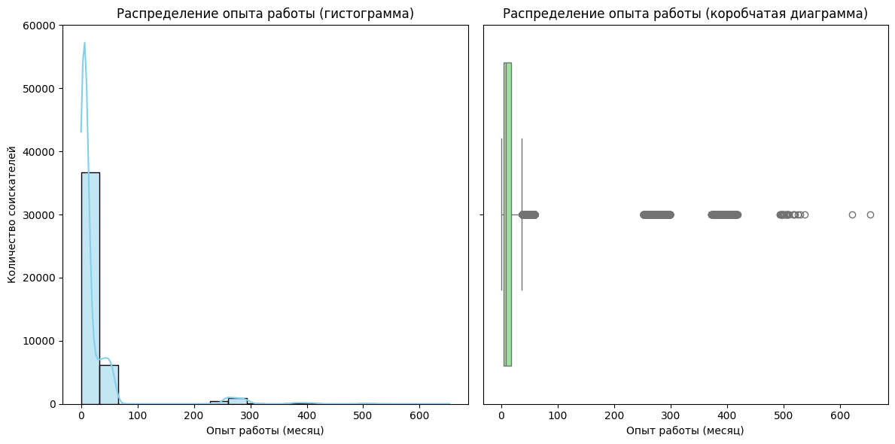

---

### 4. Распределение распределение признака "ЗП (руб)"
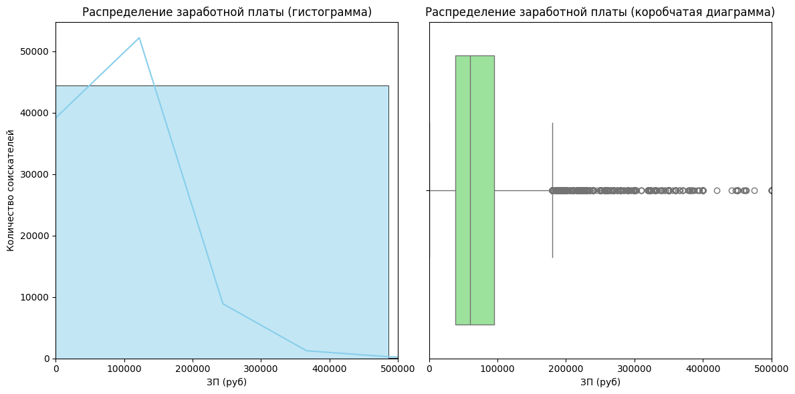

---

### 5. Диаграмма зависимости медианной желаемой заработной платы "ЗП (руб)" от уровня образования
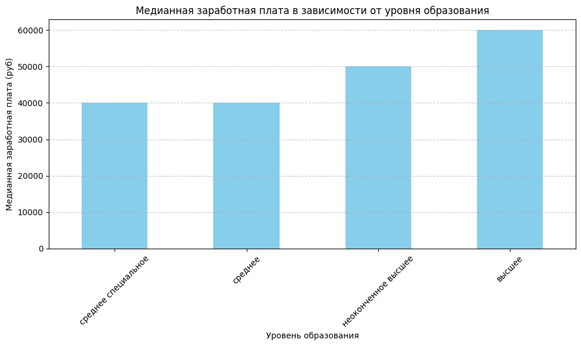

---

### 6. Диаграмма распределение желаемой заработной платы "ЗП (руб)" в зависимости от города
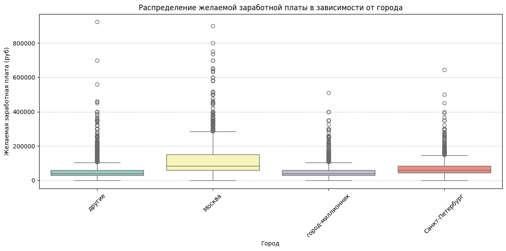

---

### 7. Столбчатая диаграмма зависимости медианной заработной платы "ЗП (руб)" от признаков "Готовность к переезду" и "Готовность к командировкам"
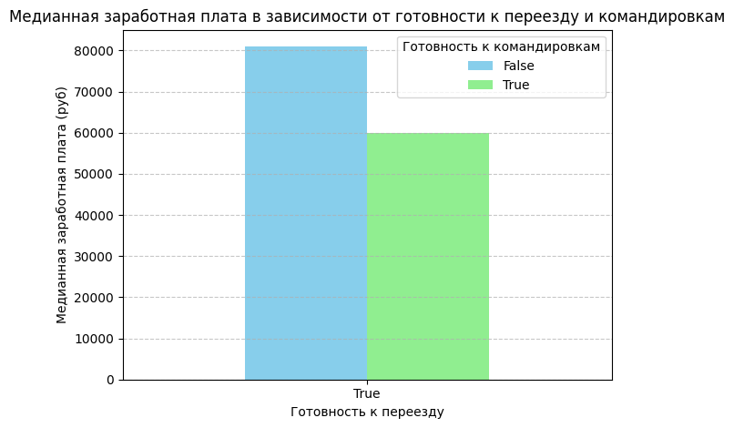

---

### 8. Тепловая карта медианной желаемой заработной платы от возраста и образования
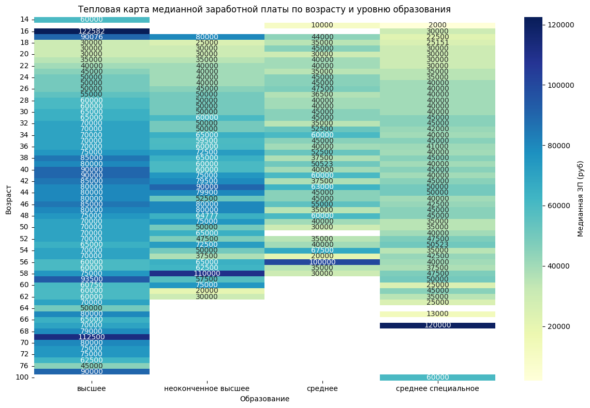

---

### 9. Диаграмму рассеяния зависимости опыта работы от возраста
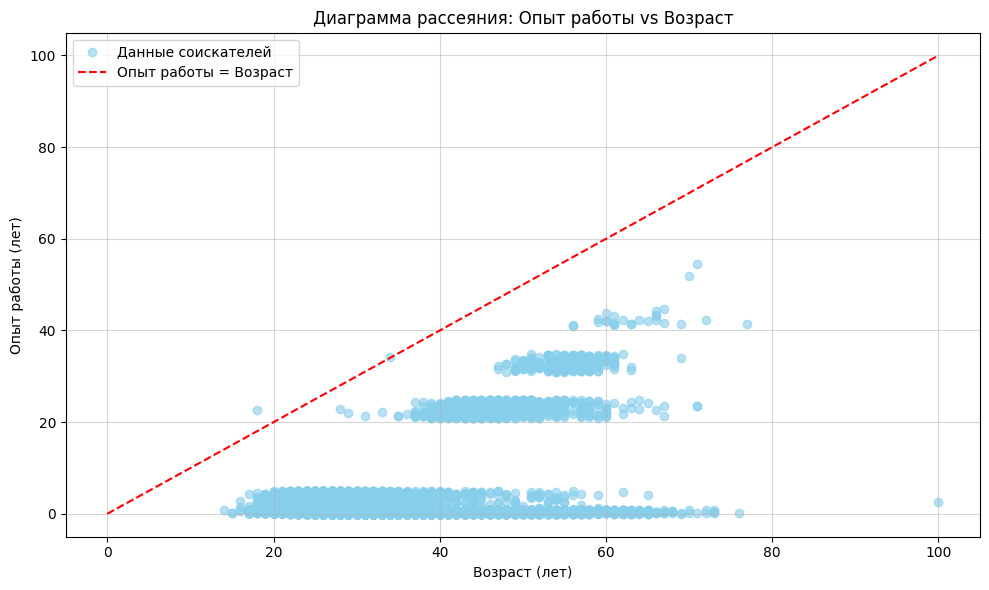

---

### 10. Медианный опыт работы по уровням образования
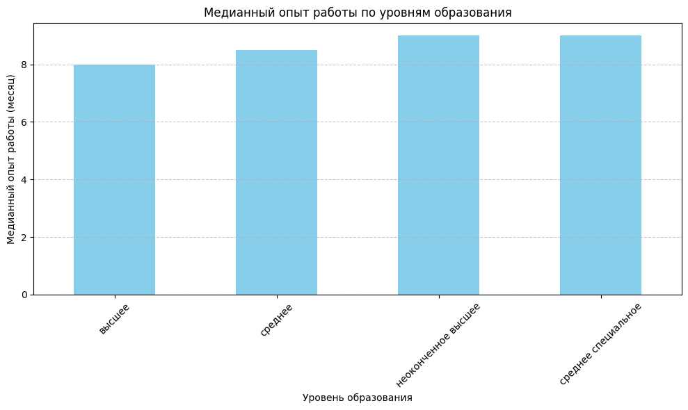

---

### 11. Медианные заработные платы по категориям образования и готовности к переезду и командировкам
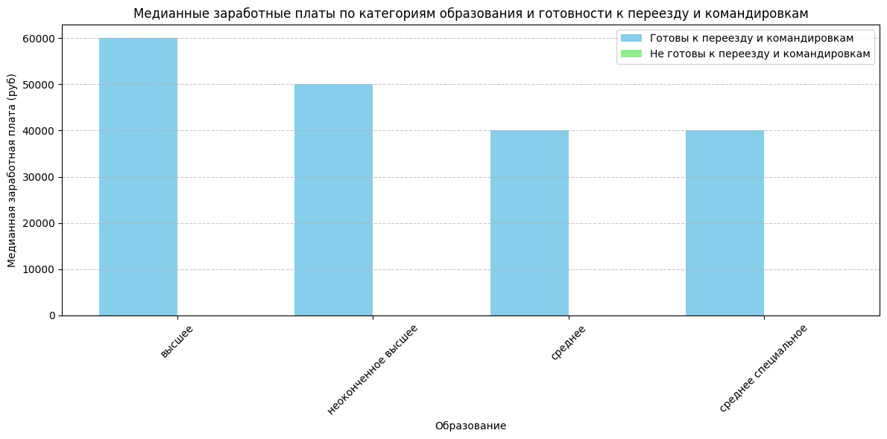

---

### 12. Распределение возраста в логарифмическом масштабе
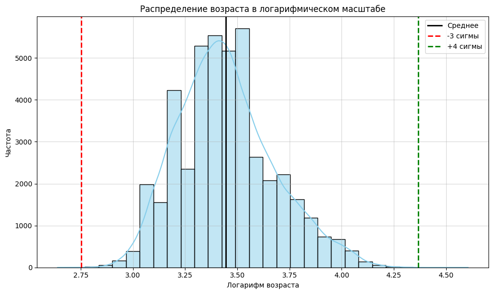

---

## О проекте
Данный проект направлен на анализ данных соискателей, а также визуализацию ключевых характеристик, таких как возраст, опыт работы и ожидаемая заработная плата.
